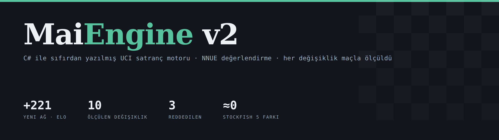
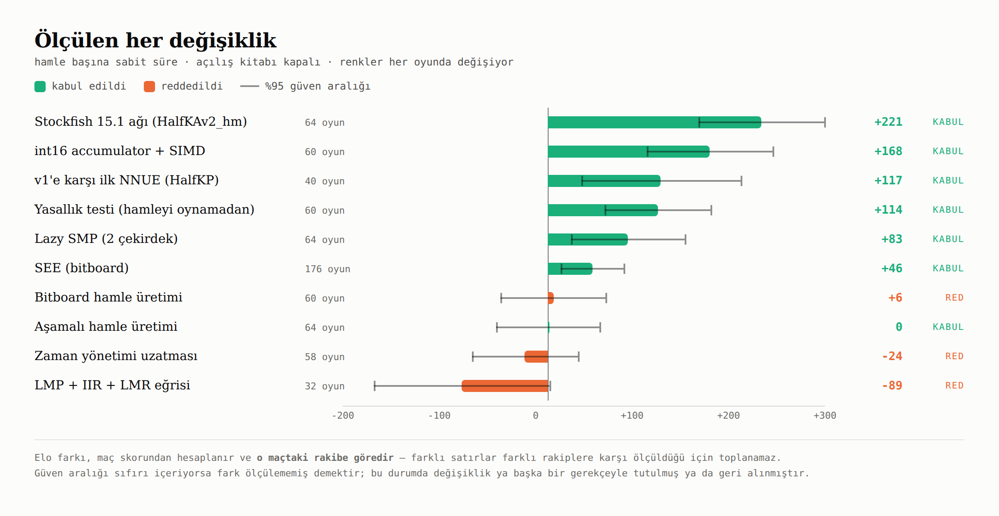
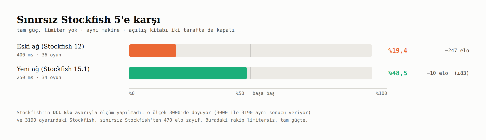

<p align="center">
  
</p>

<p align="center">
  <a href="LICENSE"></a>
  
  
</p>

**MaiEngine v2**, C# ile sıfırdan yazılmış bir UCI satranç motorudur. Kendi
grafik arayüzü yok: bir satranç arayüzüne ya da turnuva programına motor olarak
eklenir, standart girdi/çıktı üzerinden UCI konuşur.

[MaiEngine](https://github.com/Justmaii/MaiEngine)'in ikinci sürümü.
Arama, hamle üretimi ve tahta temsili kendi kodu; **değerlendirme** için
Stockfish'in NNUE ağını kullanıyor.

Projenin asıl konusu motorun kendisi kadar **nasıl geliştirildiği**: hiçbir
değişiklik "daha iyi göründüğü için" tutulmadı. Her biri maçla ölçüldü, ve
ölçüm kazanç göstermeyenler — kodu çalışıyor olsa bile — geri alındı.

## Hızlı başlangıç

```bash
git clone https://github.com/Justmaii/MaiEngineV2.git
cd MaiEngineV2
curl -L -o nn-big.nnue https://raw.githubusercontent.com/official-stockfish/networks/master/nn-ad9b42354671.nnue
dotnet build -c Release
```

Satranç arayüzüne eklerken (Cute Chess, Arena, BanksiaGUI):

| Alan | Değer |
|---|---|
| Command | `dotnet <yol>/bin/Release/net10.0/MaiEngineV2.dll uci` |
| Working directory | depo klasörü (ağ dosyası orada aranır) |
| Protocol | UCI |

Tarayıcıda oynamak için `dotnet run -c Release web`, terminalde `dotnet run -c Release play`.

## Ölçümler

<p align="center">
  
</p>

Üç değişiklik reddedildi, biri kazanç göstermediği hâlde başka bir gerekçeyle
tutuldu (hız, büyük ağın ön şartı). Ayrıntılar aşağıdaki bölümlerde, her biri
oyun sayısı ve güven aralığıyla.

<p align="center">
  
</p>

## Neler var

**Arama:** iterative deepening, negamax + alpha-beta, ana varyant araması (PVS),
transposition table (kilitsiz, çok iş parçacığı için XOR doğrulamalı), null-move
budaması, geç hamle azaltması (LMR), aspiration windows, ters futility, futility
budaması, quiescence + delta budaması, SEE ile alış budaması ve sıralaması, şah
uzatması, killer + history sıralaması, aşamalı hamle üretimi, **Lazy SMP** ile
çok çekirdekli arama.

**Değerlendirme:** Stockfish 15.1'in NNUE ağı (HalfKAv2_hm, 1024×2, 8 katman
yığını) — inference kodu bu depoya ait ve Stockfish'in çıktısıyla birebir
doğrulandı. Stockfish 12'nin eski HalfKP ağı da destekleniyor.

**Tahta:** 8×8 dizi + bitboard'lar, Zobrist hashing, Polyglot açılış kitabı
desteği, UCI zaman yönetimi, ve motoru başka motorlara karşı oynatan dahili
maç aracı.

**UCI ayarları:** `Hash`, `Threads`, `OwnBook`, `BookFile`, `Clear Hash`.

**Yok:** ponder, Syzygy tablebase, Chess960.

## Doğrulama

Bu projede hiçbir hızlı yol, yerini aldığı yavaş yolla karşılaştırılmadan
kullanılmadı:

| Komut | Ne yapıyor | Ölçek |
|---|---|---|
| `perft` | Hamle üretimi, 5 standart pozisyon | 27 test |
| `bignet` | Yeni ağ vs Stockfish 15.1'in ham çıktısı | **300/300 birebir** |
| `nnuecheck` | Eski ağ vs Stockfish 12'nin ham çıktısı | **300/300 birebir** |
| `bigaccverify` | Artımlı accumulator vs sıfırdan hesap | 185.939 düğüm |
| `accverify` | Aynısı, eski ağ | 7.037.881 düğüm |
| `pseudocheck` | `IsPseudoLegal` vs hamle üreteci | 14,7 milyon kontrol |
| `attackcheck` | Bitboard saldırı sorgusu vs mailbox sürümü | 23,8 milyon karşılaştırma |
| `seecompare` | Bitboard SEE vs mailbox SEE | 1.272.951 alış |
| `bbcheck` | Hızlı kayan taş maskesi vs yavaş referans | 512.384 maske |

Ayrıca `perft` her düğümde Zobrist anahtarını, piyon anahtarını, bitboard
tutarlılığını, ucuz yasallık testini ve alış/sessiz hamle ayrımını kontrol eder.

## Kendi maçını çalıştır

Motor, başka bir UCI motoruna karşı kendi kendine maç oynayabilir:

```bash
dotnet run -c Release matchuci /yol/rakip-motor 64 150     # 64 oyun, hamle başına 150 ms
dotnet run -c Release matchclock /yol/rakip-motor 20 600 6000   # saatli: 10 dk + 6 sn
dotnet run -c Release openings 60 8 openings.epd           # dengeli açılış seti üret
```

## Lisans: GPLv3

v1 MIT lisanslı. v2 **GPLv3**, çünkü kullandığı ağ Stockfish'in ağı ve
Stockfish GPLv3. Bu yüzden ayrı repo — v1'in lisansı değişmesin diye.

## Ağ dosyası depoda değil

Motor `nn-big.nnue` dosyasını çalıştığı klasörde arar (Stockfish 15.1'in ağı,
47 MB). İndirmek için:

```bash
curl -L -o nn-big.nnue https://raw.githubusercontent.com/official-stockfish/networks/master/nn-ad9b42354671.nnue
```

Eski ağ (`nn.nnue`, Stockfish 12'nin HalfKP ağı) hâlâ destekleniyor ve yeni ağ
yoksa ona düşülür.

### Eski notlar

`nn-82215d0fd0df.nnue` (21 MB) buraya dahil edilmedi. Kendin indir:

```bash
curl -L -o nn.nnue \
  https://github.com/official-stockfish/networks/raw/master/nn-82215d0fd0df.nnue
```

Motor açılışta `nn.nnue` dosyasını arar; `MAIENGINE_NNUE` ortam değişkeniyle
başka bir yol da verebilirsin.

Bu, Stockfish 12 dönemi **HalfKP** mimarisidir: 41024 girdi → 256x2 → 32 → 32 → 1.
Güncel Stockfish ağları farklı mimaride ve bu okuyucu onları açmaz.

## NNUE nasıl çalışıyor

Pozisyondaki her (kendi şahının karesi, taş, taşın karesi) üçlüsü bir
**özellik** numarasıdır. Ağın ilk katmanı bu özelliklerin ağırlıklarını
toplar — yani aslında dev bir arama tablosu.

Toplama işlemi olduğu için bir hamlede her şeyi baştan hesaplamak gerekmez:
çıkan özelliği çıkar, gireni ekle. Adındaki "efficiently updatable" bu.
Ölçümde **30 kat** fark yaratıyor.

Tek istisna şah: özellik indeksi kendi şahının karesini içerdiği için şah
oynayınca o bakışın bütün indeksleri kayar ve baştan hesap gerekir. Rakibin
şahı özellik olmadığından diğer bakış etkilenmez.

## Doğrulama

Nicemlenmiş aritmetikte hata sessizdir — motor "çalışır" ama yanlış oynar.
O yüzden her parça bir referansa karşı sınanıyor:

| Test | Ne yapıyor | Sonuç |
|---|---|---|
| `nnuecheck` | 300 pozisyonda değeri Stockfish 12'nin kendi çıktısıyla karşılaştırır | **300/300 birebir** |
| `accverify` | Ağaçta her düğümde artımlı accumulator ile sıfırdan hesabı karşılaştırır | **7.037.881 düğüm** |
| `perft` | Hamle üretimi, Zobrist ve piyon anahtarı (v1'den devralındı) | 27 test |

Referans değerler, Stockfish 12 kaynağına iki satırlık yama atılıp ham tamsayı
değeri bastırılarak üretildi — normal `eval` çıktısı iki ondalığa yuvarlıyor
ve birebir karşılaştırmaya yetmiyor.

```bash
dotnet run -c Release nnuecheck nn.nnue docs/nnue-ref.txt
dotnet run -c Release accverify nn.nnue 3
```

## Çalıştırma

v1 ile aynı komutlar:

```bash
dotnet run -c Release web        # tarayıcıda oyna
dotnet run -c Release uci        # UCI modu
dotnet run -c Release bench      # derinlik ölçümü
```

## Sonuç: v1'e karşı +206 elo

64 oyun, hamle başına 150 ms, iki tarafta da açılış kitabı kapalı:

| | |
|---|---|
| v1 (elle yazılmış değerlendirme) | 15,0/64 (%23,4) |
| **v2 (bugünkü hâli)** | **49,0/64 (%76,6)** |
| Elo farkı | **+206** (%95 güven: +130 .. +281) |
| v2 için G/B/Y | 39 / 20 / 5 |

Bu sayı doğrudan ölçüldü. Gün içinde ölçülen tek tek kazançlar (+117 NNUE,
+168 accumulator hızı, +114 yasallık testi, +83 lazy SMP) farklı rakiplere
karşı alındığı için **toplanamaz**; v1'e karşı gerçek fark yukarıdaki tek
maçtan gelir.

## İlk NNUE ölçümü: +117 elo


40 oyun, hamle başına 200 ms, iki tarafta da açılış kitabı kapalı:

| | |
|---|---|
| v1 (elle yazılmış değerlendirme) | 13,5/40 (%33,8) |
| **v2 (NNUE)** | **26,5/40 (%66,2)** |
| Elo farkı | **+117** |
| v2 için G/B/Y | 18 / 17 / 5 |

40 oyunda hata payı kabaca ±85 elo, yani büyüklük yaklaşık. Ama yön net:
belirleyici 23 oyunun 18'ini v2 kazandı.

**Bu sonucun anlamı:** v2 aynı sürede v1'den **2 hamle daha sığ** arıyor
(3 sn'de derinlik 14 vs 16). Buna rağmen kazanıyor. Yani bu motorda
değerlendirme kalitesi, iki hamlelik arama derinliğinden daha değerli.

### Hız

NNUE değerlendirme elle yazılandan pahalı, iki şey bunu telafi ediyor:

| Aşama | Derinlik (3 sn) | Derinlik 14 süresi |
|---|---|---|
| Naif (her seferinde sıfırdan) | — | oynanamaz |
| Artımlı accumulator | 12 | — |
| + katmanlarda vektör komutları (SIMD) | 14 | 2918 ms |
| + int16 accumulator, vektörleştirilmiş özellik güncellemesi | **16** | **1565 ms** |

Artımlı güncelleme olmadan v2 oynanabilir değildi. Son adımda accumulator
`int32` yerine `int16` tutuluyor (kopyalanan veri yarıya indi) ve özellik
ekleme/çıkarma döngüsü ile clipped ReLU vektörleştirildi: **1,86x hızlanma,
aynı sürede 2 ply daha derin**.

Bu adımın doğruluğu üç ayrı yerden kontrol edildi: `nnuecheck` 300/300 birebir,
`accverify` 7 milyon düğüm birebir, ve `bench` çıktısında **düğüm sayıları her
derinlikte tıpatıp eşit** — yani değerlendirme bit düzeyinde değişmedi, sadece
hızlandı.

Ölçüm (60 oyun, hamle başına 100 ms, aynı ağ, tek değişken hız):

| | |
|---|---|
| Hızlandırılmış sürüm | 43,5/60 (%72,5) — 30 G / 27 B / 3 Y |
| Elo farkı | **+168** |

## Turnuva saati ve zaman yönetimi

Turnuvada süre hamle başına değil, saatle gelir: "toplam 10 dakika + hamle
başına 6 saniye". Motorun payını kendi ayırması gerekir. Bunun için `TimeManager`
ve UCI'da `wtime/btime/winc/binc` okuma eklendi — ayrıca maç aracına **saatli
maç** modu (`matchclock`), çünkü zaman yönetimi sabit hamle süresiyle
ölçülemez: saat yoksa ölçülecek bir şey de yoktur.

Denenen fikir: pozisyon oynaksa (en iyi hamle değişiyorsa ya da puan düşüyorsa)
ayrılan payı aşıp 3 kata kadar düşünmek. **58 oyun, 10 sn + 0,1 sn: −24 elo**
(%95 güven −79..+31). Kazanç yok, hatta hafif eksi — geri alındı.

Kalan davranış ölçülmüş olan: motor ayırdığı payı aşmıyor, ve bitiremeyeceği
bir iterasyona başlamıyor. Altyapı duruyor, fikir tekrar ölçülebilir.

## SEE: pahalıyken zarardı, ucuzlayınca kazanç

SEE (static exchange evaluation) bir alışın, o karede yaşanacak bütün
alışveriş bittiğinde kaç santipiyon bıraktığını arama yapmadan hesaplar.
İlk sürümü mailbox tahtayla yazılmıştı: her çağrıda 64 kare kopyalanıyor ve
saldıran yön yön aranıyordu. 150 oyunda **%49** verdi — hesap doğruydu ama
maliyeti kazancını yiyordu, o yüzden kapalı bırakılmıştı.

Bitboard sürümü aynı cevabı veriyor, ama tahta kopyalamıyor: doluluk
maskesinden taş çıktıkça arkasındaki uzun menzilli taş kendiliğinden
devreye giriyor (x-ray), ayrı koda gerek kalmıyor.

| | |
|---|---|
| 176 oyun, 150 ms | 99,5/176 (%56,5) |
| Elo farkı | **+46** (%95 güven: +13 .. +79) |

Artık varsayılan olarak açık. Doğrulama: `seecompare` eski mailbox sürümüyle
**1.272.951 alışta** birebir aynı sonucu verdi, `seecheck` 6 birim testi geçiyor.

## Yeni ağ: Stockfish 15.1 mimarisi — +221 elo

v2 ilk çıktığında Stockfish 12'nin ağını kullanıyordu (HalfKP, 256x2, 21 MB).
Artık Stockfish 15.1'in ağını kullanıyor: **HalfKAv2_hm, 1024x2, 8 katman
yığını, 47 MB**. Mimari sıfırdan yazıldı; ağ dosyası Stockfish'in.

Eskisinden beş farkı var:

1. **Kral kovaları ve yatay aynalama.** Özellik indeksi artık şahın tam
   karesini değil, hangi bölgede olduğunu kullanıyor (32 kova), ve şah vezir
   kanadındaysa tahta yatay aynalanıyor. Böylece ağ simetriyi baştan biliyor,
   aynı şeyi iki kez öğrenmek zorunda kalmıyor.
2. **Şahlar da özellik.** HalfKP'de şahlar özellik değildi.
3. **İkişerli çarpım.** İlk katmanın 1024 çıktısı ikişer çarpılıp 512'ye
   iniyor. Bu ağa ikinci dereceden bir terim kazandırıyor — tek katmanla
   ifade edilemeyecek ilişkileri öğrenebiliyor.
4. **8 katman yığını.** Taş sayısına göre farklı ağırlıklar: açılış ve final
   aynı ağla değerlendirilmiyor.
5. **PSQT dalı.** Ağın yanında, doğrudan özelliklerden gelen ayrı bir
   materyal/konum terimi; sonuç ikisinin toplamı.

### Ölçüm

| | |
|---|---|
| 64 oyun, 150 ms, eski ağa karşı | 50,0/64 (%78,1) — 37 G / 26 B / **1 Y** |
| Elo farkı | **+221** (%95 güven: +156 .. +287) |

Ağ düğüm başına daha pahalı (349 bin düğüm/sn, eskisi 493 bin) ama **aynı
derinliğe daha az düğümle** ulaşıyor: değerlendirme iyileştikçe arama daha
isabetli buduyor. Sonuçta derinlik 16'ya eskisinden **hızlı** varıyor
(1.333 ms vs 1.890 ms).

### Doğrulama

| Test | Sonuç |
|---|---|
| `bignet` — 300 pozisyonda Stockfish 15.1'in ham çıktısıyla | **300/300 birebir** |
| `bigaccverify` — artımlı accumulator vs sıfırdan hesap | **185.939 düğüm** |

Referans değerler, Stockfish 15.1 kaynağına `rawnnue` komutu eklenip ham
tamsayı değer bastırılarak üretildi — eski ağda kullanılan yöntemin aynısı.

İlk yazımda değerlendirme oynanamayacak kadar yavaştı (72 bin düğüm/sn).
Ağırlıklar yükleme sırasında `short`'a genişletilip iç çarpımlar
vektörleştirilince **4,6 kat** hızlandı ve sonuç bit düzeyinde değişmedi
(300/300 hâlâ birebir).

## inphish 4.0.0'a karşı: −376 elo

Aynı ağı kullanan bir rakibe karşı ölçüm — yani değerlendirme eşit, fark
tamamen arama ve hızda.

| | |
|---|---|
| 34 oyun, 1 dk + 0,6 sn, dengeli açılış seti | 3,5/34 (%10,3) |
| Elo farkı | **−376** (%95 güven: −504 .. −248) |
| G / B / Y | 0 / 7 / 27 |

Önceki karşılaşma (eski ağ, 1+0.01) **20-0-0** kaybedilmişti, yani %0.

**Farkın kaynağı ölçüldü: derinlik.** Oyunlarda biz 11-13 ply, rakip 17-21 ply
arıyor. Bu seviyelerde her ply kabaca 50-70 elo eder; altı-yedi plylik fark
gördüğümüz −376'yı tek başına açıklıyor.

Somut örnek, 7. turdan:

| Hamle | MaiEngine | inphish |
|---|---|---|
| 41...Qd2 | **0,00** (derinlik 11) | +1,87 |
| 42.Re5 | — | **+8,27** (derinlik 14) |
| 42...Qxf2+ | −2,34 | +8,38 |

41. hamlede kaleyi tek korumayla bırakıyoruz; `Re5` gelince iki saldırı bir
koruma kalıyor ve malzeme gidiyor. Rakip bunu üç ply önceden gördü, biz
göremedik. Değerlendirme aynı, hesap aynı — fark sadece ne kadar ileriye
bakabildiğimiz.

Bu yüzden sıradaki iş arama verimi ve hız: ProbCut, singular extension,
counter-move sıralaması, correction history. Ama önce **ölçüm altyapısı**:
bu tekniklerin her biri 20-40 elo getirir, 34 oyunun hata payı ise ±128.
Göremeyeceğimiz bir kazancı ölçmeye çalışmak, dün gece iki değişikliği
"0 elo" diye işaretlememize yol açtı.

## Nerede duruyoruz: Stockfish 5'e karşı

Mutlak elo ölçmenin dürüst yolu, yayınlanmış gücü olan bir motora karşı
oynamaktır. Referans olarak **Stockfish 5** (2014, sınırsız, tam gücüyle)
derlendi ve aynı makinede oynandı:

| | Skor | Elo farkı |
|---|---|---|
| Eski ağ (Stockfish 12), 400 ms, 36 oyun | 7,0/36 (%19,4) | **−247** |
| **Yeni ağ (Stockfish 15.1), 250 ms, 34 oyun** | **16,5/34 (%48,5)** | **−10** (%95: −93..+72) |

Yani tek gecede, aynı referansa karşı **−247'den başa baş duruma** geldik.

Buradan "elomuz şu" diye bir sayı çıkarmıyoruz. Stockfish 5'in eski CCRL
listelerindeki yeri 3050-3100 civarıydı, ama o listeler 40 hamle/40 dakika
ile ve başka donanımda ölçülür; biz hamle başına 250 ms oynadık. Söylenebilecek
en dürüst cümle şudur: *sınırsız Stockfish 5 ile, bu süre kontrolünde, başa baş.*

### Not: Stockfish'in `UCI_Elo` ayarı bir cetvel değil

Bir motoru "Stockfish'i N elo'ya kilitleyip" ölçmek yaygın ama yanıltıcı.
Ölçtük:

| Rakip | Skorumuz (eski ağ) |
|---|---|
| Stockfish, UCI_Elo=2000 | %100 |
| Stockfish, UCI_Elo=2400 | %93,8 |
| Stockfish, UCI_Elo=2800 | %78,1 |
| Stockfish, UCI_Elo=3000 | %40,6 |
| Stockfish, UCI_Elo=3190 (tavan) | %40,6 |
| Stockfish, sınırsız | %6,3 |

3000 ile 3190 **aynı** sonucu veriyor: ölçek orada doyuyor. Ve "3190" ayarındaki
Stockfish, sınırsız Stockfish'ten 470 elo zayıf. Yani o ayarlardaki sayılar
rakibin gerçek gücü değildir.

## Tembel accumulator: denendi, kazanç vermedi

Her hamlede 1024 değer x 2 bakış kopyalanıyor. Stockfish bunu tembelleştirir:
hamle yapıldığında sadece "bu hamle şunları değiştirdi" notu alınır, toplamlar
ancak değerlendirme istendiğinde hesaplanır. Aramanın budadığı dallarda o iş
hiç yapılmaz.

Yazıldı, doğrulandı (**7.037.881 düğüm**, değerlendirme kasten seyrekleştirilip
hesaplanmamış seviyelerden zincir oluşturularak), ve ölçüldü:

| | derinlik 16'ya süre |
|---|---|
| Tembel | 1.134 ms |
| Hevesli (mevcut) | **1.076 ms** |

Kazanç yok, hatta muhasebe maliyeti yüzünden hafif eksi. **Geri alındı.**

Sebebi ilginç: tembelliğin atlayacağı iş, aramanın *değerlendirmeden*
yaptığı hamleler. Ama o hamlelerin ana kaynağını daha önce zaten ortadan
kaldırmıştık — yasallık testi artık hamleyi oynamıyor. Geriye neredeyse
hiçbir şey kalmamış: yapılan her hamlenin ardından zaten değerlendirme
geliyor.

Yani bir optimizasyon, başka bir optimizasyonun değerini sıfırlamış.

## int8 komutları: değerlendirme 2,25 kat hızlandı

NNUE'de girdi de ağırlık da tek bayt, ve işlemcilerde tam bu iş için komutlar
var: dört 8-bit çarpımını tek seferde yapıp toplayanlar. İlk yazımda bunlar
kullanılmıyordu — baytlar 16-bit'e genişletilip çarpılıyordu, yani aynı iş
dört kat fazla komutla yapılıyordu.

| | x86 | ARM (Apple Silicon) |
|---|---|---|
| Komut | `vpmaddubsw` + `vpmaddwd` (AVX2) | `sdot` |

İlk katman her değerlendirmede 16 × 1024 = **16.384 çarpma** yapıyor, yani
buradaki fark doğrudan hissediliyor:

| | değerlendirme/sn | derinlik 16'ya süre |
|---|---|---|
| 16-bit vektör (önceki) | 186.567 | 2.371 ms |
| **int8 komutları** | **419.287** | **1.404 ms** |

Değerlendirme **2,25 kat**, arama toplamda **1,69 kat** hızlandı.

Yukarıdaki ölçüm x86'da (AVX2). Apple Silicon'da (`sdot`) aynı ölçüm:
**307.219 → 571.428 değerlendirme/sn, yani 1,86 kat.** Fark, .NET'in o
makinede 128-bit vektör kullanmasından: eski yol tek seferde 8 değer
işlerken `sdot` 16 baytı dörder gruplayarak işliyor. Düğüm
sayıları birebir aynı kaldı (465.661), yani motor farklı oynamıyor — sadece
aynı işi daha hızlı yapıyor.

Her iki yol da 300 referans pozisyonda birebir aynı sonucu veriyor. İşlemcide
int8 komutu yoksa 16-bit yola düşülür (skalere değil — o çok pahalı).
Karşılaştırma için `MAIENGINE_INT8=0` ve `MAIENGINE_NOSIMD=1` duruyor.

**Ölçüm notu:** bu ölçümü ilk yaptığımda `bench` çıktısının son satırlarını
karşılaştırdım ve int8'in *daha yavaş* olduğu sonucuna vardım. Hata şuydu:
iki yapılandırma aynı sürede farklı derinliklere ulaşıyor, yani son satırlar
farklı işleri ölçüyor. Karşılaştırma **aynı derinlikte** yapılmalı.

## Magic bitboard: doğru ama küçük

Kayan taş saldırıları artık tek çarpma ve tek tablo okumasıyla bulunuyor.
Fikir şu: bir kareden çıkan ışınların üstündeki taşlar dışında hiçbir şey
sonucu değiştirmez (kenarlar da sayılmaz — kenardaki taşın arkası yok).
Kale için en fazla 12, fil için 9 kare kalıyor, yani 4096 durum; hepsinin
cevabı önceden hesaplanıp saklanıyor. Geriye tek soru kalıyor: dağınık 12
biti 0-4095 arası bir indekse nasıl çevirmeli? Öyle bir çarpan bulmalı ki
çarpımın üst bitleri her durum için farklı çıksın. O çarpan analitik olarak
bulunmuyor — rastgele denenip tutanı alınıyor, ve bu yükleme sırasında bir
kez yapılıyor (sabit tohumla, her çalıştırmada aynı sayılar).

| | klasik ray | magic |
|---|---|---|
| perft toplamı | 1.229 ms | **1.168 ms** |
| arama, sabit derinlik | 308.000 düğüm/sn | **317.000 düğüm/sn** |

Yani **yaklaşık %3-5**. Küçük, çünkü saldırı üretimi artık darboğaz değil:
zamanın çoğu NNUE değerlendirmesinde ve `MakeMove`'da geçiyor.

**Bu değişiklik için maç sonucu verilmiyor.** %3 hız kabaca 2 elo eder;
64 oyunun hata payı ±54. Ölçemediğimiz bir şeyi ölçmüş gibi sunmanın anlamı
yok. Tutulma gerekçesi doğrulanmış olması ve ileride değerlendirme
ucuzlarsa kazancın büyüyecek olması — iddia değil, gerekçe.

Doğrulama: `bbcheck` 512.384 doluluk örneğinde yavaş referansla birebir aynı.
Klasik yol `MAIENGINE_CLASSICRAYS=1` ile geri gelir; ikisi karşılaştırılabilsin diye duruyor.

## Arama teknikleri: ölçüldü, reddedildi

Büyük motorlarda standart olan üç teknik eklendi ve ölçüldü:

- **Geç hamle budaması (LMP):** sığ derinlikte, sıralamanın gerisine düşmüş
  sessiz hamleleri hiç aramamak.
- **İçsel iterasyon azaltması (IIR):** tabloda hamle yoksa sıralama kördür,
  bir ply azaltıp aramak.
- **Logaritmik LMR eğrisi:** sabit "4. hamleden sonra 1, 8.'den sonra 2"
  yerine derinliğe ve sıraya göre artan azaltma.

| Yapılandırma | Oyun | Skor | Elo |
|---|---|---|---|
| Yalnız LMR eğrisi | 16 | %50 | 0 |
| Yalnız LMP | 16 | %50 | 0 |
| Yalnız IIR (derinlik ≥ 4, her düğüm) | 16 | %37,5 | −89 |
| Yalnız IIR (derinlik ≥ 6, ana varyant hariç) | 16 | %50 | 0 |
| **Üçü birden** | **32** | **%37,5** | **−89** |

Tek tek zararsız, birlikte zararlı. Sebebi ölçümde görünüyor: üçü açıkken
arama aynı sürede derinlik 16 yerine **23**'e iniyor — yani ağaç çok daha
fazla budanıyor. Kağıt üstünde etkileyici, tahtada daha kötü: budanan
dalların bir kısmı gerçekten önemliymiş.

**Üçü de varsayılan olarak kapalı.** Kod duruyor ve ortam değişkeniyle
açılabiliyor (`MAIENGINE_LMP=1`, `MAIENGINE_IIR=1`, `MAIENGINE_LMRCURVE=1`),
çünkü farklı eşiklerle, "improving" bayrağıyla ya da counter-move
sıralamasıyla birlikte tekrar denenmeye değerler. Ama ölçülmeden açılmazlar.

## Hız: ölçülebilir kazanç, ölçülemeyen elo

Üç değişiklik yapıldı ve hepsi ham hızı artırdı:

1. **Hamle listesi tahsisi kaldırıldı.** Arama saniyede yüz binlerce düğüm
   geziyordu ve her düğümde yeni `List<Move>` ayırıyordu. Artık her derinliğin
   önceden ayrılmış tamponu var.
2. **Quiescence doğrudan alışları istiyor.** Eskiden bütün hamleleri üretip
   alışları ayıklıyordu. Aramanın düğümlerinin çoğu quiescence'ta geçtiği için
   bu tek başına ciddi bir israftı.
3. **Aşamalı hamle üretimi.** Sıra: tablodaki hamle → alışlar ve terfiler →
   killer hamleler → sessiz hamleler. Sessizler ancak sıra onlara gelirse
   üretiliyor; düğümlerin çoğunda hiç üretilmiyorlar.

Sekiz pozisyonda sabit derinlik (11) ölçümü:

| | düğüm/sn | toplam süre |
|---|---|---|
| önce | 309.000 | 8.516 ms |
| sonra | **433.000** | **7.431 ms** |

Yani **%40 ham hız, %13 daha kısa sürede aynı derinlik.**

**Ama maç bunu göremedi:** 64 oyunda 32,0/64, yani **0 elo** (%95 güven
−54..+54). Bu bir çelişki değil, ölçü sınırı: %13 hız kabaca 0,2 ply demek,
o da 8-10 elo eder — 64 oyunun hata payı ise ±54. Bu büyüklükteki bir farkı
görmek için birkaç yüz oyun gerekir.

Değişiklik yine de tutuldu: hız ölçüldü ve gerçek, ve daha büyük bir ağa
geçmenin ön şartı — büyük ağ düğüm başına çok daha pahalı.

### Bu adımın doğrulamaları

| Test | Sonuç |
|---|---|
| `pseudocheck` — `IsPseudoLegal` hamle üreteciyle aynı mı | **14,7 milyon kontrol** (7,3M gerçek + 7,4M uydurma hamle) |
| `perft` içinde — alış + sessiz = hepsi, ne eksik ne fazla | her düğümde |
| `perft`, `nnuecheck`, `seecheck`, taktik testleri | hepsi geçiyor |

`IsPseudoLegal` gerekliydi çünkü tablodaki hamle artık üretilmeden deneniyor;
tablo çakışırsa başka pozisyonun hamlesi gelir ve doğrulanmadan oynanırsa
tahtayı bozar.

## Lazy SMP: çok çekirdekli arama

Yardımcı iş parçacıkları aynı pozisyonu bağımsız arar. Aralarındaki tek bağ
paylaşılan transposition table: biri bir dalı çözünce sonucu tabloya yazar,
diğerleri o dalı ucuza geçer. Kimse kimseye iş dağıtmaz — "lazy" adı buradan.

Bunun için transposition table kilitsiz hale getirildi. Kayıt artık iki
64-bit alan: paketlenmiş veri ve *anahtar XOR veri*. Bir okuyucu yarı yazılmış
bir kaydı görürse XOR tutmaz ve kayıt yokmuş sayılır — kilit maliyeti olmadan
bozuk kayıt kullanma ihtimali sıfır. Yan etki olarak kayıt 40 bayttan 16 bayta
indi, yani aynı bellekte 2,5 kat daha çok pozisyon tutuluyor.

| | |
|---|---|
| 2 iş parçacığı, 64 oyun | 39,5/64 (%61,7) |
| Elo farkı | **+83** (%95 güven: +24 .. +142) |
| Gezilen düğüm | ~1,8x |

Ölçüm iki çekirdekli bir makinede yapıldı: sıra kimdeyse sadece o taraf
düşündüğü için iki iş parçacıklı taraf iki çekirdeği, tek iş parçacıklı taraf
bir çekirdeği kullandı — yani ölçülen şey tam olarak "aynı sürede iki çekirdek,
bir çekirdeğe karşı". Daha çok çekirdekte kazancın artması beklenir ama bu
ölçülmedi, iddia edilmiyor.

Varsayılan hâlâ tek iş parçacığı; turnuva arayüzü `setoption name Threads`
ile ayarlar.

### Doğrulama

Yarış koşulu sessizdir: bozuk bir kayıt yanlış hamle ürettirir ve bu maçta
"kötü oynadı" gibi görünür. O yüzden `smp` modu her pozisyonda dönen hamlenin
gerçekten legal olduğunu kontrol ediyor, ve 64 oyunluk maç boyunca (yaklaşık
5.000 hamle, iki iş parçacığı) tek bir legal olmayan hamle ya da çökme olmadı.
Tek iş parçacıklı düğüm sayıları değişiklikten önce ve sonra birebir aynı.

## Bitboard'lar: kazanç beklenen yerde değildi

8x8 dizi (mailbox) korundu, yanına 64-bit maskeler eklendi: her renk ve her taş
türü için bir maske, artı doluluk maskesi. Tahtaya yazan **tek** bir fonksiyon
var (`SetSquare`), bitboard'lar orada güncelleniyor — yani ikisi ayrışamaz, ve
yine de perft ağacında her düğümde karşılaştırılıyor.

Kayan taş saldırıları "klasik" yöntemle: her kare ve yön için hazır maske,
doluluk ile kesiştir, ilk engeli bul, arkasını sil.

| Adım | Ölçüm | Sonuç |
|---|---|---|
| `IsSquareAttacked` bitboard'a çevrildi | derinlik 16: 2479 → 2456 ms | **~%1, yok sayılır** |
| Yasallık testi hamleyi oynamadan yapılıyor | derinlik 16: 2479 → 1647 ms | **+114 elo** |
| Hamle üretimi bitboard'a çevrildi | 60 maç: %50,8 | **+6 elo — ölçülemez, geri alındı** |

**Asıl bulgu ikinci satırda.** Eski kod bir hamlenin legal olup olmadığını
anlamak için hamleyi gerçekten oynuyordu: `MakeMove` → şah kontrolü →
`UnmakeMove`. Ama `MakeMove` Zobrist anahtarını, piyon anahtarını, tekrar
geçmişini ve en pahalısı **NNUE accumulator'ını** da güncelliyor — oysa test
edilen hamlelerin çoğu hiç oynanmayacak. Yeni `IsMoveLegal` sadece kareleri
(ve onlara bağlı bitboard'ları) geçici değiştirip soruyor, geri alıyor:

| | önce | sonra |
|---|---|---|
| perft (pozisyon 5, derinlik 4) | 809 ms | **126 ms** (6,4x) |
| bench derinlik 14 | 1144 ms | **725 ms** |
| 3 saniyede ulaşılan derinlik | 16 | **17** |
| 60 oyun, 100 ms | — | **39,5/60 (%65,8) → +114 elo** |

Düğüm sayıları birebir aynı kaldı: davranış değişmedi, sadece boşa yapılan iş
kalktı. Yani bitboard'ların kazancı "maskeler daha hızlı" değil, **"artık
hamleyi oynamadan yasallığını sorabiliyoruz"** oldu.

Üçüncü satır neden geri alındı: hamle üretimi bitboard'la %6 hızlandı, ama
üretim sırası değişince hamle sıralamasının eşitlik kırma düzeni bozuldu ve
arama aynı derinlik için ~%25 daha çok düğüm gezdi. İkisi birbirini götürdü
(60 maçta %50,8). Kazanç olmadığı ölçüldüğü için karmaşıklık da tutulmadı —
sıralama üretim sırasından bağımsız hâle getirilirse yeniden denenebilir.

### Bu adımın doğrulamaları

| Test | Ne yapıyor | Sonuç |
|---|---|---|
| `bbcheck` | Hızlı kayan taş maskesini yavaş referansla karşılaştırır | **512.384 maske birebir** |
| `attackcheck` | Bitboard saldırı sorgusunu eski mailbox sürümüyle, 64 kare x 2 renk | **23.800.192 karşılaştırma aynı** |
| `perft` içinde | Bitboard'lar mailbox ile tutuyor mu + ucuz yasallık testi pahalı referansla aynı mı | her düğümde, 27 test OK |

## Ağ denemesi: ölçtük, fark yok

Stockfish'in ağ deposundaki 15 ağ bu mimariyle (HalfKP, dosya boyutu tam
21.022.697 bayt) uyumlu. Hepsi indirilip yüklenebildiği doğrulandı, sonra her
biri kullandığımız ağa karşı 20 maç oynadı. Çıkan tablo ±90 elo arasına
dağıldı — ama 20 maçın istatistiksel gürültüsü de tam olarak bu genişlikte,
yani tablo hiçbir şey söylemiyor.

Ön elemede en iyi görünen ağ (`nn-04cf2b4ed1da`) 60 maça çıkarıldı:
**%45, −35 elo**. Yani "+89" tesadüftü.

**Sonuç: ağ değiştirilmedi.** Bu, kaydedilmeye değer bir negatif sonuç —
ön elemedeki ilk tabloya güvenip ağı değiştirmek, "geliştirdim" diyerek
motoru kötüleştirmek olurdu.
